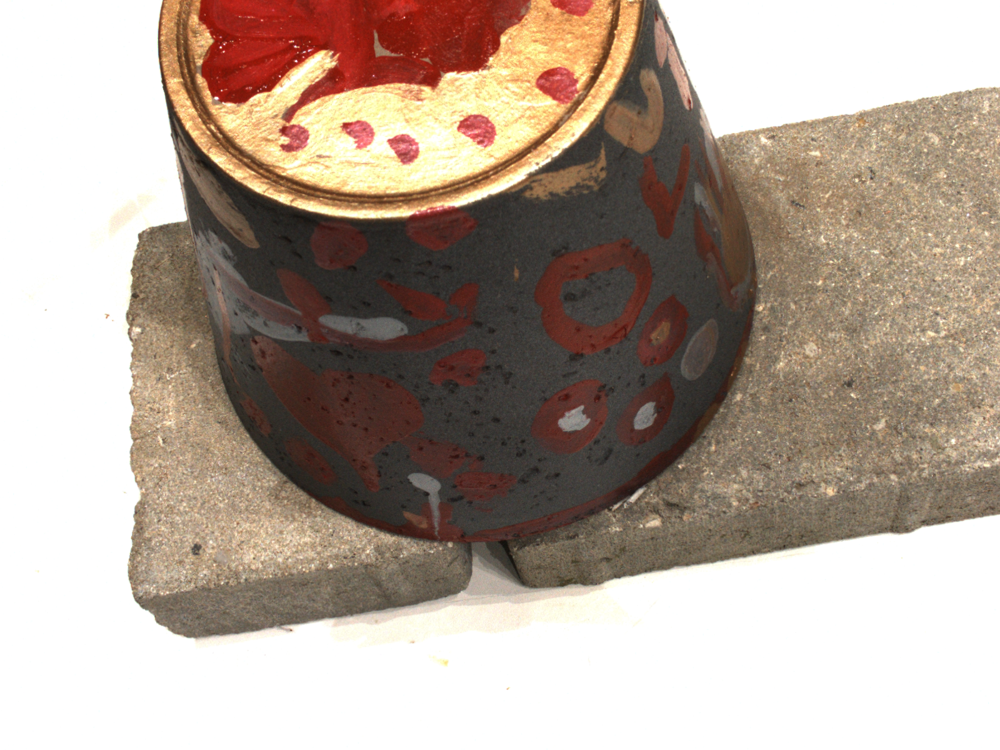
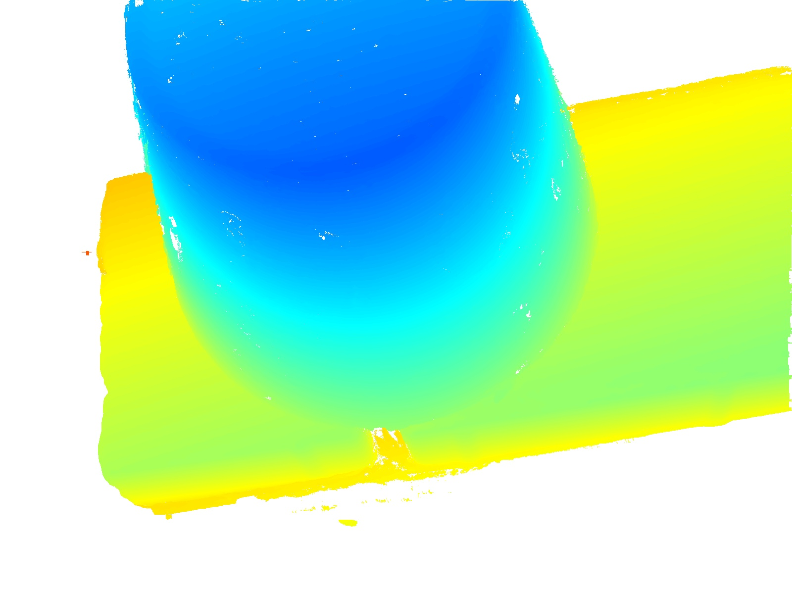
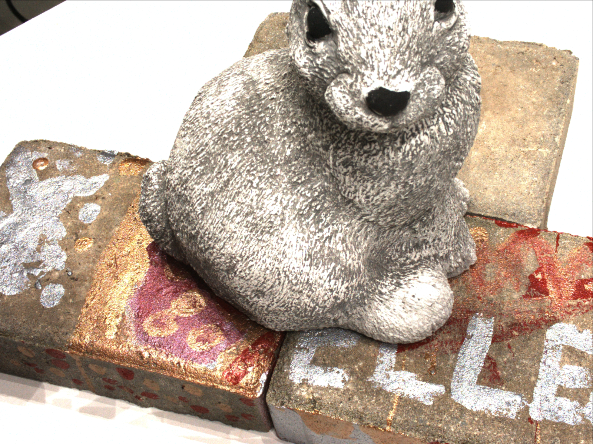
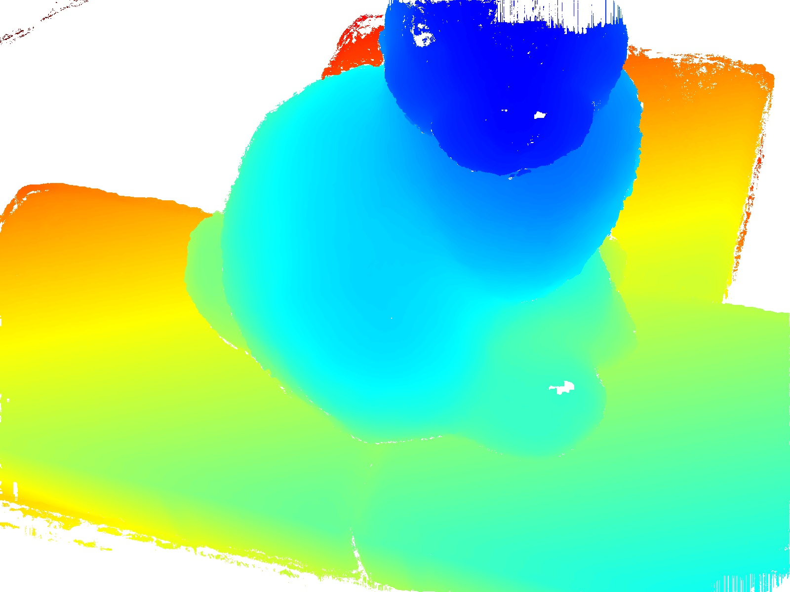

# colmap_dense_recon

Visualize the depth map generated by colmap

​	`python visualize_dense.py xxx.bin`

 <table align="center">
  <tr>
    <td></td>
    <td></td>
  </tr> 
  <tr>
    <td></td>
    <td></td>
  </tr>
  <tr>
    <td>RGB images</td>
    <td>colmap depths (geometric)</td>
  </tr>
</table>
